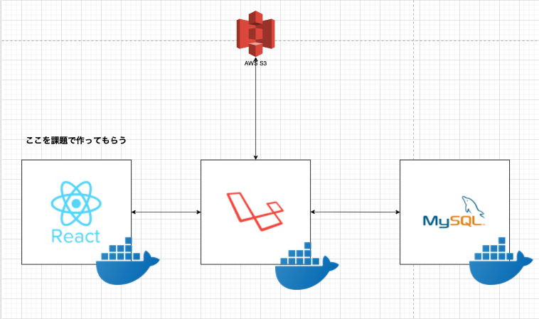

# react-task-template

フロントエンドフレームワーク課題のテンプレートです。
このリポジトリを手元の PC に取り込んで、課題を実施するようにしてください。

## 課題を終えた時の姿

- React.js を利用したフレームワーク実装が一人称で進めれる
- TypeScript を用いて、型安全な実装を進めることができる
- 再利用性の高いコンポーネント実装ができる
- コンポーネント設計の代表である Atomic Design を理解している
- API を叩くという、非同期処理実装を理解している
- git/github を利用したチーム開発手順を理解している
- Jest を利用したテストコード実装ができる
  - これは必須にしていないので、人によって定着するかが分かれる

## 全体構成

- フロントエンド
  - React.js
- バックエンド
  - Laravel API
- DB
  - MySQL

全てコンテナ環境で稼働できるように構成しています。
今回の課題ではこの構成のフロントエンド開発を担当してもらいます。



## 環境構築

課題を実施する前に、下記手順を踏んでください。

- `node.js`のインストール
- `docker`のインストール
- `src/laravel/.env`に[リンク](https://www.notion.so/plantsprogramming/bd282fcbc78045d8a4488dde4c8cb312#98ffd52be53947b090346637bb32dde1)の環境変数を上書きする

- `docker-compose.yml`のあるディレクトリで下記コマンド実施。docker のコンテナを立ち上げる
  - `docker-compose up -d`
- Laravel コンテナ内でマイグレーションの実行し、テーブル作成。
  - `docker exec -it laravel bash`
    - laravel コンテナに入る
  - `php artisan migrate`
    - DB に設定を反映(テーブルを作っている)
  - `exit`
    - コンテナを抜ける

※環境構築で不具合が発生した場合は篠田まで連絡お願いします

## 開発

課題の進め方は[github flow](https://atmarkit.itmedia.co.jp/ait/articles/1708/01/news015.html)で進めてください。

- master ブランチから新規ブランチを切る
- 新規ブランチで実装を進める
- git で適宜コミット
- github に push
- github 上で PR を作って、レビュー実施
  - PR の書き方は[こちら](https://hydrakecat.hatenablog.jp/entry/2018/06/30/%E3%83%AC%E3%83%93%E3%83%A5%E3%83%BC%E3%81%97%E3%81%A6%E3%82%82%E3%82%89%E3%81%84%E3%82%84%E3%81%99%E3%81%84PR%E3%81%AE%E6%9B%B8%E3%81%8D%E6%96%B9)を参考に
- レビューを実施した人がマージ

## 開発時のドキュメント

- [interface設計書](https://www.notion.so/plantsprogramming/interface-538d22eee8b446c98a0736416d471bc6)
- [画面詳細設計書](https://www.notion.so/plantsprogramming/b2bd4df7a4ce40509645c6e8659993fe)

## フロントエンド

React.js\* TypeScript を利用した Web アプリケーションです
`src/client`配下がフロントエンドのディレクトリになります。

### ディレクトリ構成

```
- src
  - pages
    - ページコンポーネント置き場
  - components/{コンポーネント単位}
    - ページコンポーネントで利用する、各種コンポーネント置き場
    - コンポーネントは共通利用できる形を意識する
  - tests/{page名}/{テストファイル}
   - テスト用ファイル置き場
   - ロジックのテストコードはここに置いていく
```

### 実装方針

- コンポーネントの実装は`関数コンポーネント`\* `Hooks`で統一する
  - 現在の React.js を利用した開発では、`関数コンポーネント`が主流のため
- コンポーネントはどのページでも利用しやすいように再利用性を考慮する
- コンポーネントの役割を明確化する
  - 見た目の責任を負うコンポーネントなら、ロジックの責任は持たない
  - ロジックの責任を負うコンポーネントなら、見た目の責任は持たない
  - キーワードは`単一責任の法則`

### コンポーネント管理について

コンポーネント管理に `Atomic Design` を採用します。
`src/components`ディレクトリ配下に Atomic Design のお作法に則ってコンポーネントを格納してください。

※Atomic Design については[こちら](https://blog.spacemarket.com/code/atomic-design%E3%82%92%E4%BD%BF%E3%81%A3%E3%81%A6react%E3%82%B3%E3%83%B3%E3%83%9D%E3%83%BC%E3%83%8D%E3%83%B3%E3%83%88%E3%82%92%E5%86%8D%E8%A8%AD%E8%A8%88%E3%81%97%E3%81%9F%E8%A9%B1/)を参照

### テスト

テストコードは全て `tests` ディレクトリに格納します。
`Jest`を用いたテストコードについては全て上記ディレクトリで管理するようにしてください。

※課題のなかでテストコード実装するのは必須ではありません。 興味がある人は実施してみてください。

### 記事一覧画面のページネーションについて

記事一覧でページネーション実装が存在しています。
ページネーション実装のためにダミーの投稿された記事が必要だと思うのですが、下記コマンドを順番に実施することで記事を作ってくれます。

記事一覧画面の実装に入った段階で、下記コマンドを実施してください

- `docker exec -it laravel bash`
  - laravel コンテナに入る
- `php artisan tinker`
  - Laravel の対話型実行環境を起動
- `App\Models\Article::factory()->count(50)->create()`
  - 記事データを 50 件作るコマンド
- `exit`
  - コンテナを抜ける

## バックエンド

Laravel を用いた API です。
`src/laravel`配下がバックエンドのディレクトリになります。

本課題では触ることはありませんが、最初の環境構築時に何点かセットアップが必要です。
[環境構築](#環境構築)セクションを参考にセットアップしてください。
